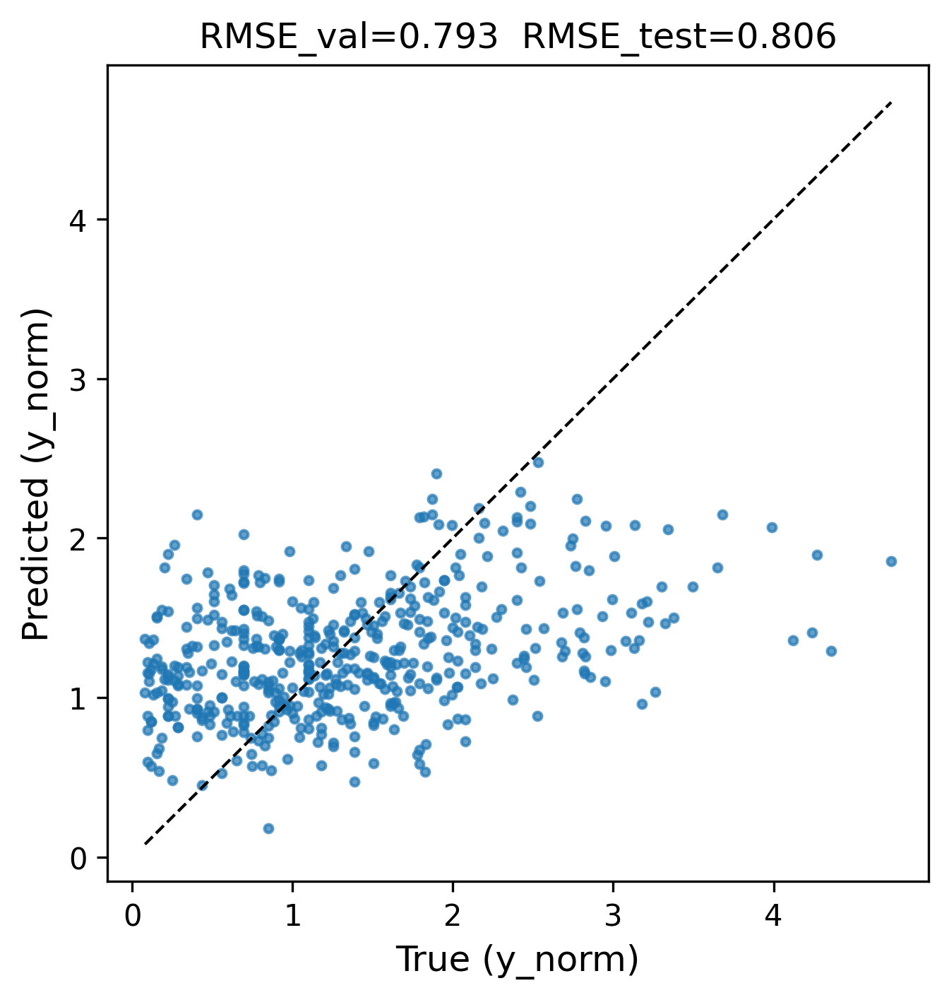

# TEFormer

Welcome to the **TEFormer** project!

TEFormer is a domain-specific transformer model designed for the thermoelectric materials research community.  
It automatically ingests new papers from arXiv, predicts their potential citation impact, and recommends emerging studies.  
Trained on thousands of arXiv publications using a custom BPE tokenizer and BERT encoder, it estimates log-normalized citation rates and classifies papers as “read” or “skip.” Deployed as an automated arXiv Evaluation API, it enables daily, data-driven literature triage. TEFormer improves RMSE over baseline models and quantifies researcher time savings. Future work includes expanding to other domains, integrating Large Language Models (LLMs) for enhanced reasoning, and building knowledge graphs to reveal emerging scientific connections.

---

## Features
- Automated arXiv paper ingestion  
- Citation impact prediction  
- High-impact paper recommendations  

---

## Model Test Results: Citation Prediction
<figure style="text-align:center;">
  
  <figcaption style="font-size:0.9rem; color:#666;">
    The model was tested on 488 thermoelectric papers. RMSE is computed on log(1 + citations / years since publication), normalizing for publication age. The diagonal line represents ideal prediction parity.
  </figcaption>
</figure>

---

<!-- MONTHLY_TABLE_BEGIN -->

## This Month's Thermoelectric Papers

Below is a list of all papers **published this month**, sorted by predicted citation impact.  
Papers we predict to be high-impact are highlighted with a ⭐.

| # | Title | DOI | Pred. impact index | Published |
|---|-------|-----|----------------------|-----------|
| 1 | **⭐ Outstanding figure of merit at high temperature for DFT-based predicted double perovskite oxides, Ba2GaXO6 (X = V, Nb, Ta)** | [10.48550/arXiv.2511.01134](https://doi.org/10.48550/arXiv.2511.01134) | 1.84 | 2025-11-03 |
| 2 | **⭐ Enhanced Thermoelectricity in Nanowires with inhomogeneous Helical states** | [10.48550/arXiv.2511.09903](https://doi.org/10.48550/arXiv.2511.09903) | 1.83 | 2025-11-13 |
| 3 | **⭐ Applicability of Electrical Conductivity Ratio Method to Complicated Band Structure and the Carrier Scattering Mechanisms of SnSe** | [10.48550/arXiv.2511.00522](https://doi.org/10.48550/arXiv.2511.00522) | 1.58 | 2025-11-01 |
| 4 | **⭐ A Brief Perspective on Piezotronic and Thermoelectric Coupling: Flexible Platforms for Synergistic Energy Scavenging and Peltier-Caloric Effects** | [10.48550/arXiv.2511.09757](https://doi.org/10.48550/arXiv.2511.09757) | 1.58 | 2025-11-12 |
| 5 | **⭐ Phonon-Dominated Thermal Transport and Large Violation of the Wiedemann-Franz Law in Topological Semimetal CoSi** | [10.48550/arXiv.2511.06290](https://doi.org/10.48550/arXiv.2511.06290) | 1.56 | 2025-11-12 |
| 6 | High Thermoelectric Cooling Performance of Junction Thermoelectric Transistors | [10.48550/arXiv.2511.05317](https://doi.org/10.48550/arXiv.2511.05317) | 1.25 | 2025-11-07 |
| 7 | Plasma hydrodynamics from mean force kinetic theory | [10.48550/arXiv.2511.09786](https://doi.org/10.48550/arXiv.2511.09786) | 1.22 | 2025-11-12 |
| 8 | Molecular Dynamics Simulation of Hydrodynamic Transport Coefficients in Plasmas | [10.48550/arXiv.2511.09787](https://doi.org/10.48550/arXiv.2511.09787) | 1.17 | 2025-11-12 |
| 9 | Designing new Zintl phases SrBaX (X = Si, Ge, Sn) for thermoelectric applications using *ab initio* techniques | [10.48550/arXiv.2511.07031](https://doi.org/10.48550/arXiv.2511.07031) | 1.16 | 2025-11-10 |
| 10 | Topological end state and enhanced thermoelectric performance of a supramolecular device | [10.48550/arXiv.2511.08943](https://doi.org/10.48550/arXiv.2511.08943) | 1.14 | 2025-11-12 |
| 11 | Plasmon resonance in a sub-THz graphene-based detector: theory and experiment | [10.48550/arXiv.2511.06891](https://doi.org/10.48550/arXiv.2511.06891) | 1.08 | 2025-11-10 |
| 12 | Studying the thermoelectric properties of an anisotropic QGP medium | [10.48550/arXiv.2511.03054](https://doi.org/10.48550/arXiv.2511.03054) | 1.07 | 2025-11-04 |
| 13 | Noises in a two-channel charge Kondo model | [10.48550/arXiv.2511.02590](https://doi.org/10.48550/arXiv.2511.02590) | 1.05 | 2025-11-04 |
| 14 | Properties of multiterminal superconducting nanostructure with double quantum dot | [10.48550/arXiv.2511.05988](https://doi.org/10.48550/arXiv.2511.05988) | 1.00 | 2025-11-08 |

<!-- MONTHLY_TABLE_END -->
For the complete list of recommended papers, see:

👉 **[Full Recommended Papers List](papers.md)**
---

## Contact
Developed by [Yukun Liu](https://github.com/yukunl20).  
Feel free to open issues or contribute via pull requests!

